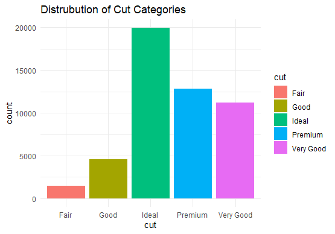
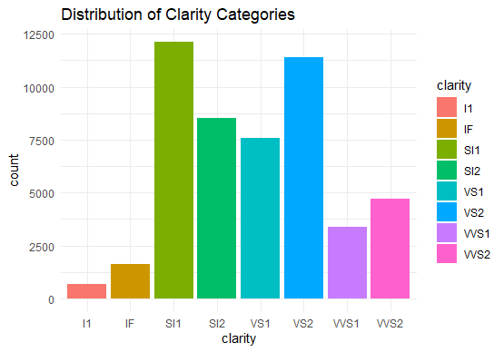
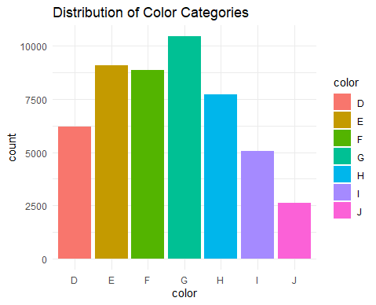

# Diamond_Dataset-\_-With-\_Rprogramming

The **`diamonds`** dataset is a built-in dataset in the **`ggplot2`** package in R. It contains measurements on 10 different variables for 50,000 different diamonds. Here are the variables included in the dataset:

1.  **`carat`**: Weight of the diamond

2.  **`cut`**: Quality of the cut (Fair, Good, Very Good, Premium, Ideal)

3.  **`color`**: Diamond color

4.  **`clarity`**: A measurement of how clear the diamond is

5.  **`depth`**: Total depth percentage = z / mean(x, y) = 2 \* z / (x + y)

6.  **`table`**: Width of top of diamond relative to widest point

7.  **`price`**: Price in US dollars

8.  **`x`**: Length in mm

9.  **`y`**: Width in mm

10. **`z`**: Depth in mm

They allow us to practice data manipulation, visualization, and statistical analysis.

This will provide you with a statistical summary of each variable in the dataset.

### Data Exploration

### Distribution of Carat

### Distribution Of Cut Categories

### Distribution Of Clarity Categories

{width="555"}

